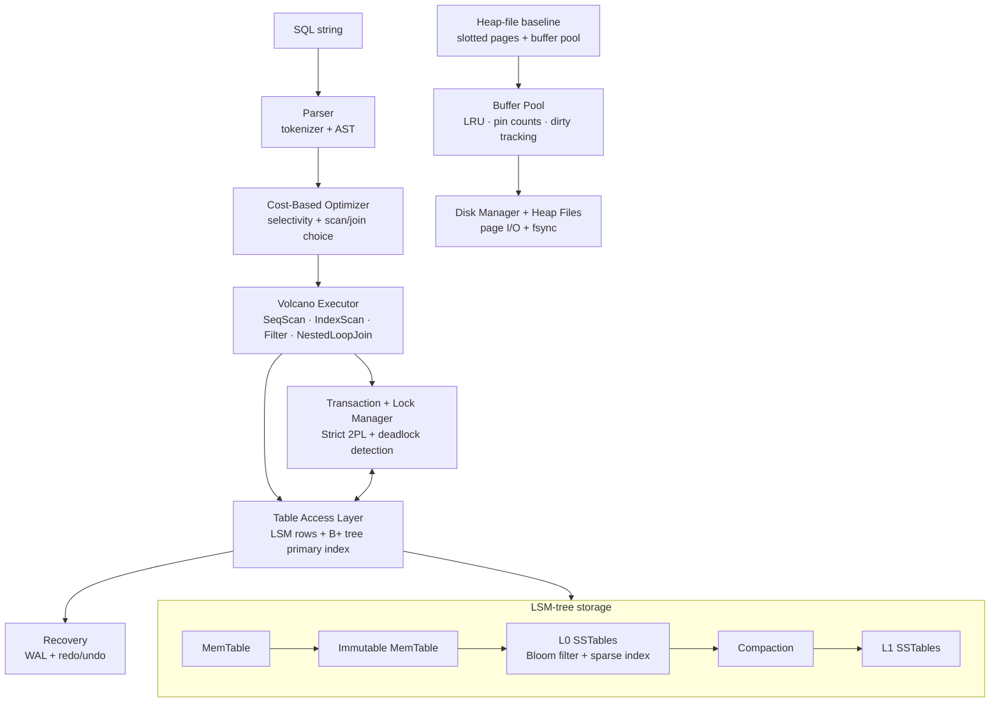
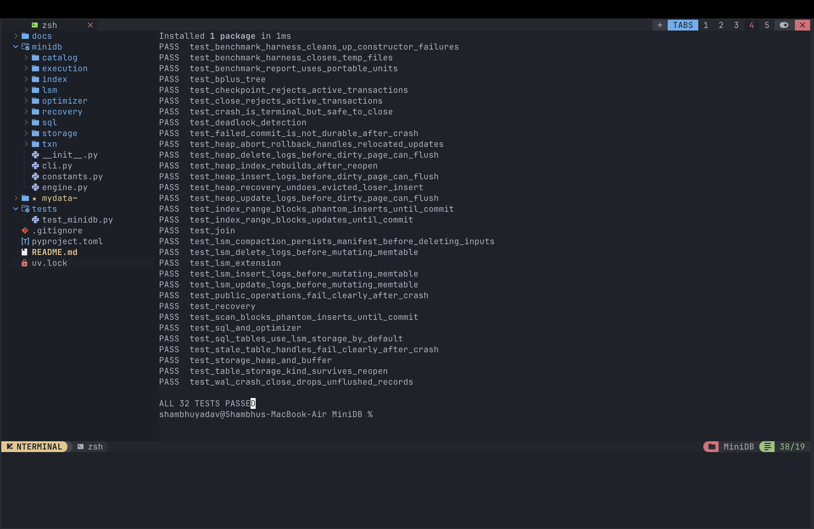
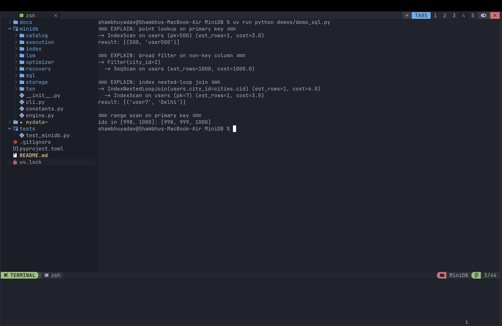
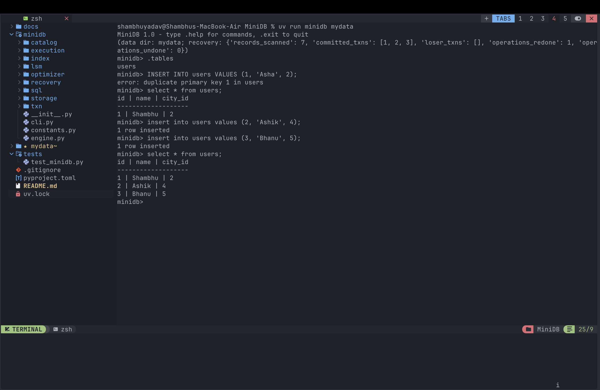
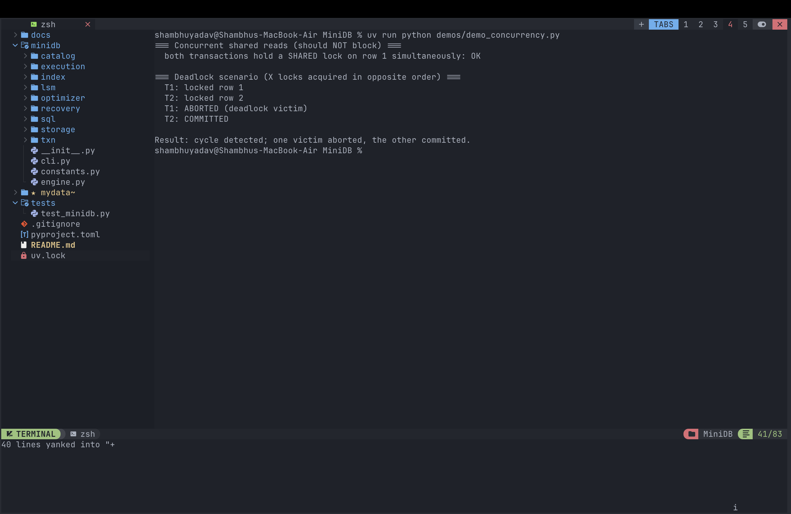
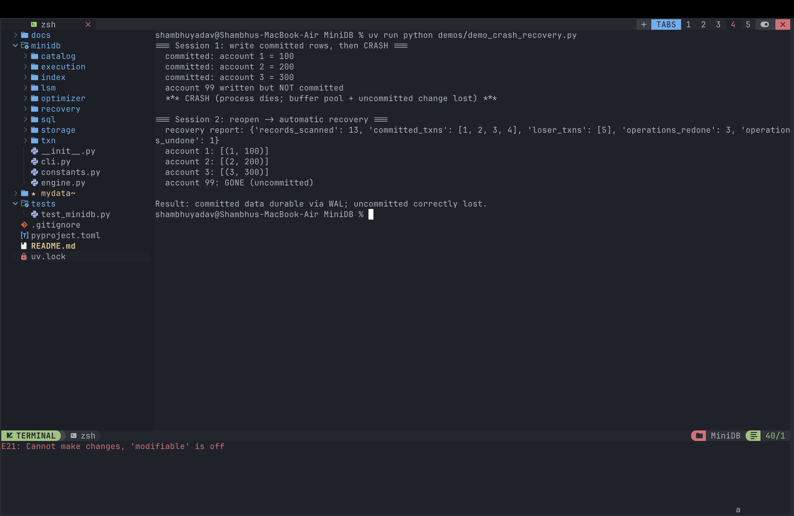
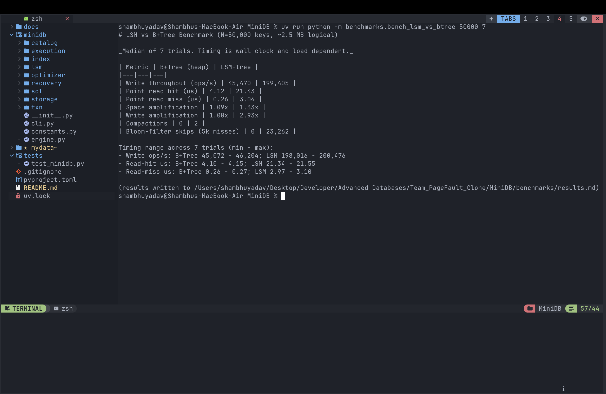

# MiniDB — A Relational Database Engine Built From Scratch

> A complete, working RDBMS implemented in **pure Python with zero third-party runtime dependencies** — from raw bytes on disk all the way up to a SQL query optimizer, ACID transactions, and crash recovery. Includes a modern **LSM-tree storage engine** benchmarked against a classic heap-file + B+ tree baseline.

<p>
  
  
  
  
</p>


---

## Why this project is interesting

Most engineers use databases every day but treat them as a black box. I built one to understand — and to be able to explain — *exactly* how a database delivers its four hardest guarantees at the same time:

- **Durability** — committed data survives a crash.
- **Isolation** — concurrent transactions don't corrupt each other.
- **Efficient access** — the right query plan and index, chosen automatically.
- **Performance under load** — and the storage trade-offs that come with it.

Every layer is implemented from first principles and is **individually demonstrable** — there is a runnable demo and an automated test for each guarantee. The engine then goes one step further with an **LSM-tree storage backend** (the architecture behind RocksDB, Cassandra, and MyRocks) wired in as the default SQL table store, and **quantifies its trade-offs with a reproducible benchmark.**

> **Summary:** a single-process RDBMS with a slotted-page storage manager, an LRU buffer pool, a B+ tree index, a SQL parser → cost-based optimizer → Volcano executor pipeline, strict-2PL concurrency with deadlock detection, WAL-based redo/undo crash recovery, and a pluggable LSM-tree storage engine — all in ~2,700 lines of dependency-free Python, with 32 passing tests.

---

## Highlights

| Area | What I built |
|---|---|
| **Storage** | 4 KB slotted pages, heap files, an LRU **buffer pool** (pin counts + dirty tracking), and a disk manager with `fsync` durability |
| **Indexing** | A real **B+ tree** — node splits, median push-up, linked leaves for range scans |
| **SQL** | Regex tokenizer + **recursive-descent parser** producing an AST (`CREATE`, `INSERT`, `SELECT`, `JOIN…ON`, `WHERE`, `DELETE`) |
| **Optimizer** | **Cost-based** plan selection: selectivity estimation, IndexScan vs SeqScan, join-order selection |
| **Execution** | **Volcano / iterator model** operators: SeqScan, IndexScan, Filter, NestedLoopJoin (index & block) |
| **Transactions** | **Strict 2PL**, serializable isolation with phantom protection, **deadlock detection** via wait-for-graph cycle search |
| **Recovery** | **Write-Ahead Logging** with the WAL invariant (fsync-before-commit), NO-FORCE policy, redo/undo crash recovery |
| **LSM-tree storage** | An **LSM-tree** storage engine (MemTable → SSTables → leveled compaction, with per-SSTable **Bloom filters**) as the default SQL backend, benchmarked head-to-head against the B+ tree baseline |

---

## Architecture



**Data flow.** `Database.execute(sql)` parses the statement, asks the optimizer for the cheapest plan, and runs it through the Volcano executor. Reads/writes go through a transaction-aware table layer that acquires locks, stores serialized rows in the LSM-tree, maintains a B+ tree primary-key index, and appends WAL records. The heap-file + buffer-pool stack remains as the baseline storage engine and the benchmark comparator.

**Module map (`minidb/`):** `storage/` (page, disk_manager, buffer_pool, heap_file) · `index/bplus_tree.py` · `lsm/` (lsm_engine, sstable, bloom) · `catalog/` · `sql/` (tokenizer, parser, ast) · `optimizer/` · `execution/` (operators, executor) · `txn/` (lock_manager, transaction) · `recovery/wal.py` · `engine.py` (facade).

---

## Demos & screenshots

Every guarantee has a runnable demo. Screenshots below are from real runs on my machine.

### ✅ Full test suite — every component verified

```bash
uv run python tests/test_minidb.py
```

The 32 tests are a checklist of the engine's guarantees — deadlock detection, phantom protection, the WAL-before-flush invariant, crash recovery, and LSM compaction safety.

<!-- 📸 SCREENSHOT: run the command above, capture the terminal showing "ALL 32 TESTS PASSED" -->



---

### 🔎 SQL + cost-based optimizer (`EXPLAIN`)

```bash
uv run python demos/demo_sql.py
```

Watch the optimizer make **opposite decisions on the same engine, purely from cost**: a primary-key equality picks **IndexScan** (cost 3 vs a 1000-row scan), a broad non-key filter falls back to **SeqScan**, and a join whose inner key is a primary key uses an **index nested-loop join**.

<!-- 📸 SCREENSHOT: capture the EXPLAIN output showing IndexScan vs SeqScan vs IndexNestedLoopJoin -->


---

### 🖥️ Interactive SQL shell

```bash
uv run minidb mydata
```
```sql
minidb> CREATE TABLE users (id INT PRIMARY KEY, name TEXT, city_id INT);
minidb> INSERT INTO users VALUES (1, 'Asha', 2);
minidb> EXPLAIN SELECT id, name FROM users WHERE id = 1;
minidb> SELECT id, name FROM users WHERE id = 1;
minidb> .stats        -- buffer-pool hit ratio, index height, row counts
minidb> .exit
```

<!-- 📸 SCREENSHOT: capture a shell session with .tables / SELECT / .stats -->


---

### 🔒 Concurrency control — Strict 2PL + deadlock detection

```bash
uv run python demos/demo_concurrency.py
```

Two concurrent transactions take exclusive locks in **opposite order**, forming a cycle in the wait-for graph. The lock manager detects the cycle via DFS, aborts one transaction as the **victim**, rolls it back, and lets the other commit — so the system never hangs.

<!-- 📸 SCREENSHOT: capture the deadlock output (T1 ABORTED victim / T2 COMMITTED) -->


---

### 💥 Crash recovery — Write-Ahead Logging

```bash
uv run python demos/demo_crash_recovery.py
```

Committed rows are **redone** from the WAL after a simulated crash; an uncommitted transaction's row is **undone** — even though the crash happened before any data page was flushed (NO-FORCE policy). The recovery report shows winners, losers, and redo/undo counts.

<!-- 📸 SCREENSHOT: capture session 2 — recovery report + accounts 1/2/3 restored, account 99 GONE -->


---

### 📊 LSM-tree vs B+ tree benchmark

```bash
uv run python -m benchmarks.bench_lsm_vs_btree 50000 7
```

50,000 keys, median of 7 trials, identical workload on both engines.

<!-- 📸 SCREENSHOT: capture the benchmark results table from the terminal -->


| Metric | B+Tree (heap) | LSM-tree | Result |
|---|---|---|---|
| Write throughput (ops/s) | 45,470 | **199,405** | LSM **~4.4× faster writes** |
| Point read — hit (µs) | **4.12** | 21.43 | B+Tree ~5.2× faster reads |
| Point read — miss (µs) | **0.26** | 3.04 | B+Tree ~11.7× faster misses |
| Space amplification | **1.09×** | 1.33× | old versions linger until compaction |
| Write amplification | **1.00×** | 2.93× | compaction rewrites data |
| Compactions | 0 | 2 | LSM background maintenance |
| Bloom-filter skips (5k misses) | 0 | 23,262 | SSTable reads avoided |

**The takeaway I was able to quantify:** an LSM-tree turns writes into cheap in-memory updates plus sequential flushes (**~4.4× write throughput**), but pays for it with read amplification (a lookup may touch several SSTables), extra space, and background compaction cost. *Optimizing writes pushes cost into reads, space, and rewrites* — measured, not just asserted.

---

## How it works (deep dive)

<details>
<summary><b>Storage layer</b></summary>

- **Slotted page (4 KB):** a 4-byte header `(num_slots, free_ptr)`; the slot directory grows forward while records grow backward from the end. A slot is `(offset, length)`, with `length == 0` marking a tombstone. Supports variable-length records and stable record ids (RIDs) `= (page_id, slot)`.
- **Buffer pool:** caches 64 frames; serves hits from memory, reads misses from disk. Pages are **pinned** while in use and carry a **dirty** flag. Replacement is **LRU over unpinned frames**; a dirty victim is written back before eviction.
- **Disk manager:** the only layer doing real syscalls — `page_id × PAGE_SIZE` offsets, `allocate_page`, and `write_page` with **fsync** for durability.
</details>

<details>
<summary><b>B+ tree index</b></summary>

All data lives in the leaves; internal nodes only route searches (`bisect_right` on separator keys). Leaf overflow splits in half (first right key copied up); internal overflow pushes the median up; a root split grows the tree by a level. Leaves are linked via a `next` pointer for range scans. Maps PK → RID in the heap baseline, PK → PK in the LSM backend.
</details>

<details>
<summary><b>Cost-based optimizer</b></summary>

Cost is measured in abstract "row-touch" units. The optimizer prices every candidate plan and picks the cheapest:

| Operation | Cost |
|---|---|
| SeqScan | `n_rows` |
| IndexScan (equality) | `INDEX_PROBE` (≈ tree height) |
| IndexScan (range) | `INDEX_PROBE + est_rows` |
| Index nested-loop join | `outer_cost + outer_rows × INDEX_PROBE` |
| Block nested-loop join | `outer_cost + outer_rows × inner_rows` |

Selectivity: PK equality → `1/n`; non-key equality → `0.2`; range → `0.33`. For two-table joins it costs both orderings and keeps the cheaper one.
</details>

<details>
<summary><b>Transactions & concurrency</b></summary>

**Strict 2PL** with Shared/Exclusive locks at row granularity plus table-level locks for scans and inserts. S/S is compatible; everything else conflicts. All locks are held until commit/abort (recoverable, no cascading aborts). **Serializable isolation** with phantom protection: scans hold a table S lock + per-row S locks, and inserts need a table X lock, so repeat scans never see phantom rows. **Deadlock detection:** before a transaction blocks, its edge is added to a wait-for graph and DFS checks for a cycle; if waiting would create one, the requester is aborted as the victim and rolled back via its undo list.
</details>

<details>
<summary><b>Crash recovery</b></summary>

**WAL** as newline-delimited JSON records (`BEGIN`, `INSERT`, `UPDATE`, `DELETE`, `COMMIT`, `ABORT`, `CHECKPOINT`). The **WAL invariant**: the log is `fsync`'d before a `COMMIT` is acknowledged. **NO-FORCE** buffer policy — commit does not force data pages. On restart, recovery scans the log after the last checkpoint, identifies winners (have a `COMMIT`), **redoes** winners in log order, then **undoes** losers in reverse.
</details>

<details>
<summary><b>LSM-tree storage engine</b></summary>

- **Write path:** `put`/`delete` update an in-memory sorted **MemTable** (deletes write tombstones). When it fills, it rotates and is flushed sequentially to an **L0 SSTable** with a sparse index and Bloom filter — never an in-place update.
- **Read path:** MemTable → immutable MemTables → L0 (newest first) → L1; newest version wins, a tombstone means deleted. **Bloom filters** skip SSTables that cannot contain the key.
- **Compaction:** merges L0 + L1 into one sorted L1 run, dropping shadowed versions and bottom-level tombstones.
- **SQL integration:** a SQL row is serialized to bytes and stored in the LSM keyed by primary key, with a B+ tree index on top — so the executor, optimizer, transactions, and WAL all run unchanged on top of it.
</details>

---

## Quick start

```bash
# Requires Python 3.9+ and uv (https://docs.astral.sh/uv/). The engine itself uses only the stdlib.

uv run python tests/test_minidb.py                       # 1) run the test suite (32 tests)
uv run python demos/demo_sql.py                          # 2) SQL + EXPLAIN
uv run python demos/demo_concurrency.py                  # 3) 2PL + deadlock detection
uv run python demos/demo_crash_recovery.py               # 4) WAL crash recovery
uv run python -m benchmarks.bench_lsm_vs_btree 50000 7   # 5) LSM vs B+ tree benchmark
uv run minidb mydata                                     # 6) interactive SQL shell
```

> No `uv`? The demos add their own path and the engine is pure stdlib, so `python3 demos/demo_sql.py` works too.

---

## What I learned / engineering decisions

- **No free lunch in storage.** Building both a B+ tree and an LSM-tree and benchmarking them made the write/read/space amplification trade-off concrete rather than theoretical.
- **The WAL invariant is the whole game for durability.** Forcing the log before commit (and only then) is what lets a NO-FORCE buffer policy stay correct across crashes.
- **Deadlock detection vs prevention.** I chose precise wait-for-graph cycle detection over coarse timeouts, so a transaction is only aborted when a real cycle exists.
- **A clean operator interface pays off.** Because every storage backend exposes the same table API (`insert`, `get_by_key`, `seq_scan`, `index_range`, `delete_by_key`), swapping the heap engine for the LSM-tree required no changes to the parser, optimizer, transactions, or recovery.

---

## Limitations & future work

Deliberate scope choices to keep the engine readable and explainable:

- B+ tree deletes use lazy leaf deletion + root collapse (not full borrow/merge rebalancing).
- Indexes are in-memory, rebuilt from persisted rows on startup (not paged to disk).
- Recovery is a simplified WAL redo/undo rather than full ARIES with page LSNs.
- The optimizer handles single-table scans and cost-ordered two-table joins; 3+ joins chain in declaration order; no aggregation / `GROUP BY` / `ORDER BY`.
- SQL surface excludes subqueries, `OR` predicates, and a SQL `UPDATE` statement (update exists in the table API).
- Single process — no client/server layer or replication.

**Next:** a paged persistent B+ tree, MVCC, `ORDER BY` / aggregation, and WAL-backed LSM compaction scheduling.

---

## Tech

Pure **Python 3.9+** (standard library only) · packaged with **uv** / **hatchling** · ~2,700 LOC across the engine · 32 automated tests.
